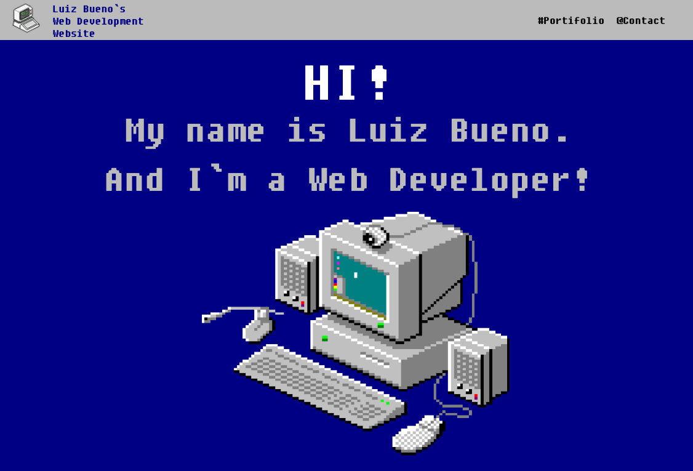

# Luiz Bueno — Personal Portfolio Website

A **static, single-page portfolio** for **Luiz Bueno**, a full-stack web developer. The site presents professional experience, education, certifications, and contact options through a deliberate **retro computing aesthetic** (pixel typography, classic “desktop” imagery, and early-web UI cues) while being implemented with a **modern React / Next.js** toolchain.

---

## Preview

The image below is a **full-page screenshot** of the application (production build served locally), captured with the **Playwright MCP** browser automation tools after the hero typewriter animation completed. It reflects the current layout: hero, biography, interactive résumé timeline, social links, and **email-only** contact in the footer.



---

## Overview

This repository contains the source code for **[luizbueno.com](https://www.luizbueno.com/)**, a marketing-style personal site rather than a SaaS product. Visitors land on a long-scrolling **home page** that sections content vertically: fixed navigation, animated introduction (**typewriter-style** headlines), a short **“about”** narrative, a **vertical timeline** of education and roles, outbound links to **LinkedIn**, **GitHub**, and an external résumé, and a **footer** inviting contact by **e-mail** (obfuscated as `contact[at]luizbueno.com` in the UI).

Additional **Pages Router** routes exist for supplementary content (e.g. certificates and focused topic pages) linked from the main narrative where relevant.

Design goals include:

- **Strong visual identity** — navy background, high-contrast type, pixel-art hero asset, and timeline cards styled for quick scanning.
- **Performance-friendly static output** — pages are pre-rendered where applicable; images go through **Next.js `Image`** with **Sharp** available for optimization in production.
- **Maintainable stack** — current dependencies target **Next.js 15**, **React 19**, and **ESLint 9** with flat configuration, while preserving the legacy **Bootstrap 2–style** layout primitives the design was built on.

---

## Key Features

| Area | Description |
|------|-------------|
| **Hero / jumbotron** | Large display type and a **typewriter animation** (`react-type-animation`) with staged delays, echoing the original `react-typist` behavior. |
| **About** | Multi-paragraph bio with emphasis on full-stack work, education (PUC Minas), continuing studies (UX / agile), and **Scrum Master** experience with a link to **Scrum.org**. |
| **Portfolio timeline** | **Vertical timeline** (`react-vertical-timeline-component`) with icons, date ranges, institutions, and role titles; uses the library’s stylesheet plus **Next.js `Image`** for timeline icons. |
| **Navigation** | Fixed top bar with in-page scroll targets for portfolio and contact sections; mobile-friendly collapse control. |
| **Social** | Distinct buttons linking to LinkedIn, GitHub, and Résumé.io. |
| **Contact** | **E-mail only** in the footer (no third-party messaging widgets in the current codebase). |
| **Head & analytics** | Global metadata via `next/head`; a third-party script is loaded in `pages/_document.js` with `beforeInteractive` where required by Next.js lint rules. |

---

## Tech Stack

| Technology | Role |
|------------|------|
| **[Next.js 15](https://nextjs.org/)** (Pages Router) | Framework, routing, `next/head`, `next/script`, `next/image`, production build. |
| **[React 19](https://react.dev/)** | UI library. |
| **[pnpm](https://pnpm.io/)** | Package manager (preferred over npm/yarn for this project). |
| **[PostCSS](https://postcss.org/)** | Pipeline with `postcss-flexbugs-fixes` and `postcss-preset-env` (no PurgeCSS — Bootstrap classes must remain intact). |
| **[Sharp](https://sharp.pixelplumbing.com/)** | Optional image optimization backend for `next/image` in production. |
| **[ESLint 9](https://eslint.org/)** + **`eslint.config.mjs`** | Linting aligned with `eslint-config-next`. |
| **`react-type-animation`** | Hero typing effect (maintained alternative to unmaintained typist packages). |
| **`react-vertical-timeline-component`** | Résumé timeline UI; **`react-intersection-observer`** is pinned via **pnpm `overrides`** for React 19 compatibility. |
| **Bootstrap 2–era CSS** (`styles/bootstrap.css`, `bootstrap-responsive.css`) | Grid, navbar, buttons, and legacy utility classes. |
| **`styles/globals.css`** | Site-specific overrides (spacing, jumbotron, social block, footer, etc.). |

---

## Repository Layout

```
├── components/
│   ├── atoms/          # e.g. shared head metadata wrapper
│   └── molecules/      # NavBar, Jumbotron, Hero, Portifolio, Social, Footer, …
├── pages/
│   ├── _app.js         # Global CSS imports
│   ├── _document.js    # HTML shell, beforeInteractive script
│   ├── index.js        # Home (main portfolio view)
│   ├── resume.js       # Additional route
│   ├── scrum.js
│   ├── ga-cert.js
│   └── 404.js
├── public/             # Static assets (favicon, `/images/*`, …)
├── styles/             # Bootstrap bundles + globals
├── docs/
│   └── site-preview.png   # README illustration (Playwright capture)
├── postcss.config.js
├── next.config.js
├── eslint.config.mjs
└── package.json
```

---

## Prerequisites

- **Node.js** — LTS version recommended (aligned with Next.js 15 support matrix).
- **pnpm** — install globally if needed: `npm install -g pnpm`.

---

## Getting Started

Install dependencies:

```bash
pnpm install
```

Run the **development** server (with hot reload):

```bash
pnpm dev
```

Open [http://localhost:3000](http://localhost:3000) (or the port shown in the terminal if 3000 is busy).

Create an optimized **production** build:

```bash
pnpm build
```

Serve the production build locally:

```bash
pnpm start
```

Run **ESLint**:

```bash
pnpm lint
```

---

## NPM Scripts

| Script | Command | Purpose |
|--------|---------|---------|
| `dev` | `next dev` | Local development. |
| `build` | `next build` | Optimized production bundle. |
| `start` | `next start` | Serve the last `build` output. |
| `lint` | `next lint` | ESLint via Next.js integration. |

---

## Deployment

The project is a standard Next.js app and can be hosted on **[Vercel](https://vercel.com/)**, any Node-capable PaaS, or a static export workflow if you later migrate to fully static hosting. Configure environment-specific domains and HTTPS at the platform level; no server-only secrets are required for the static marketing pages described here.

---

## Updating the README Screenshot

The preview image lives at **`docs/site-preview.png`**. To regenerate it with **Playwright MCP** (or any Playwright-driven browser):

1. Run `pnpm build && pnpm start` (optionally set `PORT`, e.g. `PORT=3020 pnpm start`).
2. Navigate to the local origin in a Playwright session.
3. Wait long enough for the hero **typewriter** sequence to finish (~12 seconds from a cold load).
4. Save a **full-page** PNG to `docs/site-preview.png`.

This keeps the README illustration in sync with the real UI after visual changes.

---

## Author

**Luiz Bueno** — full-stack web developer; portfolio and copy are maintained in this repository.

---

## License

This project is **private** (`"private": true` in `package.json`). All rights reserved unless otherwise stated by the author.
